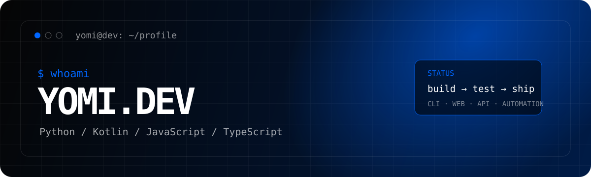

<p align="center">
  
</p>

<p align="center">
  <a href="https://yom1.me/">
    
  </a>
  <a href="https://github.com/dev-yom1">
    
  </a>
  <a href="mailto:devyomi@proton.me">
    
  </a>
</p>

## `> about`

Hi, I'm **YOMI** — a developer focused on building software and developer tools that are useful, clear, and actually runnable.

My **primary languages** are **Python, Kotlin, JavaScript, and TypeScript**. I also work across systems, data, shell, functional, hardware, blockchain, formal-methods, and legacy ecosystems.

<sub lang="ja">ソフトウェアや開発ツールを中心に開発しています。主にPython、Kotlin、JavaScript、TypeScriptを使いながら、用途に応じて幅広い言語・技術を扱っています。</sub>

```ts
const yomi = {
  role: "Developer",
  primary: ["Python", "Kotlin", "JavaScript", "TypeScript"],
  focus: ["CLI", "Web", "REST API", "Automation"],
  range: "systems → formal methods",
  approach: "build → test → ship",
};
```

## `> stack --primary`

### Primary languages

<p>
  
  
  
  
</p>

### Development

<p>
  
  
  
  
</p>

### Workflow

<p>
  
  
  
</p>

<details>
<summary><strong>More languages & technologies — 105 entries</strong> / その他の対応言語・技術</summary>

<br />

> This includes programming languages, query languages, DSLs, shells, HDLs, proof languages, and domain-specific languages. The list is intentionally broader than my primary stack.

**General / Systems**  
Java · C# · PHP · Ruby · Go · Rust · Dart · Swift · C · C++ · Assembly · Zig · Ada · D · Fortran · Objective-C · Objective-C++ · CUDA · Scala · Groovy · Nim · Crystal · V · Hack · ReScript

**Data / Query / Scientific**  
SQL · PL/SQL · T-SQL · PL/pgSQL · GraphQL · Cypher · SPARQL · DAX · Power Query M · R · Julia · MATLAB · Wolfram Language · Maple · SAS · Q · K

**Shell / Automation / Scripting**  
Bash · Shell · Zsh · Fish · PowerShell · Batch · Perl · Tcl · Lua · AppleScript

**Functional / Lisp / Concurrent**  
Haskell · OCaml · F# · Clojure · Common Lisp · Scheme · Racket · Elixir · Erlang · Standard ML · Elm

**Formal Methods / Proof**  
Agda · Idris · Coq · Gallina · Lean · Prolog

**Hardware / HDL**  
Verilog · SystemVerilog · VHDL · Chisel · SystemC · Bluespec

**Blockchain / Smart Contracts**  
Solidity · Move · Vyper · Cairo · Clarity · Michelson · Motoko

**Enterprise / Legacy**  
COBOL · Visual Basic · VB.NET · VBA · ABAP · RPG · PL/I · Delphi · Object Pascal · Pascal · PowerBuilder · Apex

**Creative / Domain-specific**  
GDScript · Haxe · Smalltalk · LabVIEW · OpenSCAD · Scratch · Logo

</details>

<!-- S7 temporarily hidden while the repository is private.
## `> projects --featured`

### [S7 — Salta7 CLI](https://github.com/dev-yom1/S7)

> A Python CLI client for operating the Salta7 Store API from the terminal.

S7 is designed to work well for both people and scripts: interactive navigation for human use, predictable machine-readable output for automation, and diagnostics for troubleshooting.

<sub lang="ja">Salta7 Store APIをターミナルから扱うPython製CLI。人が操作するときの分かりやすさと、自動処理で使いやすい出力の両方を意識して作っています。</sub>

**Highlights**

- Interactive ↑ / ↓ + Enter menu
- English / Japanese / Korean / Hindi UI
- `--json` / `--compact` / `--jsonl` machine-readable output
- Task monitoring with `--watch` / `--wait`
- Safe retries for supported API operations
- Secret masking in normal output
- `s7 doctor` API and authentication diagnostics
- pytest + GitHub Actions CI

<p>
  <a href="https://github.com/dev-yom1/S7">
    
  </a>
</p>
-->

## `> selected-work`

### 📘 Godot 4 入門 — Technical Review / Verification

Technical verification for **『手を動かして学ぶGodot 4 入門 ― Unity経験者のためのハンズオンガイド(C#版)』**. I verified the manuscript workflow end-to-end and helped isolate environment-specific issues before publication.

<sub lang="ja">Godot 4 / C# 技術書の制作に協力。原稿に沿って全手順を検証し、環境依存の事象の切り分け・確認にも参加。2026年9月Kindle出版、奥付に制作協力者として掲載。</sub>

**Godot 4 · C# · Technical Review · Debugging**

### 🐱 猫の箱 — Programmer / In Development

Participating as a programmer in **『猫の箱』**, a 3D mobile cat-raising game currently in development with Unity and C#.

<sub lang="ja">3D猫育成ゲーム『猫の箱』の開発チームにプログラマーとして参加中。公開済みのプロジェクト情報の範囲で掲載しています。</sub>

**Unity · C# · GitHub · Game Development**

## `> focus`

```text
CLI          → clear, practical developer tools
Web          → lightweight web apps and interfaces
API          → clients, integrations, and data flow
Automation   → tools that remove repetitive work
```

<sub lang="ja">CLI、Web、API連携、自動化を中心に、実際に使えるものを作ることを重視しています。</sub>

## `> contact --open`

Have a project, question, or something to build? Feel free to reach out.

- **Portfolio:** https://yom1.me/
- **GitHub:** https://github.com/dev-yom1
- **Email:** [devyomi@proton.me](mailto:devyomi@proton.me)

---

<p align="center">
  <code>build → test → ship</code><br />
  <sub>Code it. Run it. Make it useful. / コードを書いて、ちゃんと使える形まで仕上げる。</sub>
</p>
